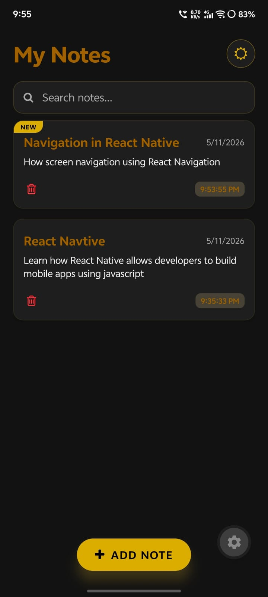
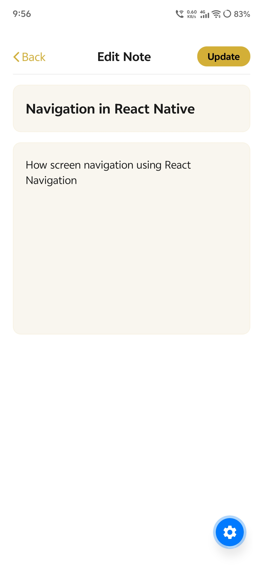

# Notes App 📝

A modern and minimal React Native Notes App built with Expo featuring dark/light mode support, note creation, search functionality,edit existing note, delete a note and a clean mobile UI.

# Screenshots

### watch all screens go  ` ./assets/images/app `

## Components and hooks
- SafeAreaView
- ScrollView
- View
- KeyboardAvoidingView
- useState
- useEffect
- Button
- Pressable
- useColorScheme
- TextInput
- Text 
- StyleSheet
- Alert
- FontAwesome

[X post](https://x.com/thevishaal_/status/2053886111580377365?s=20)
